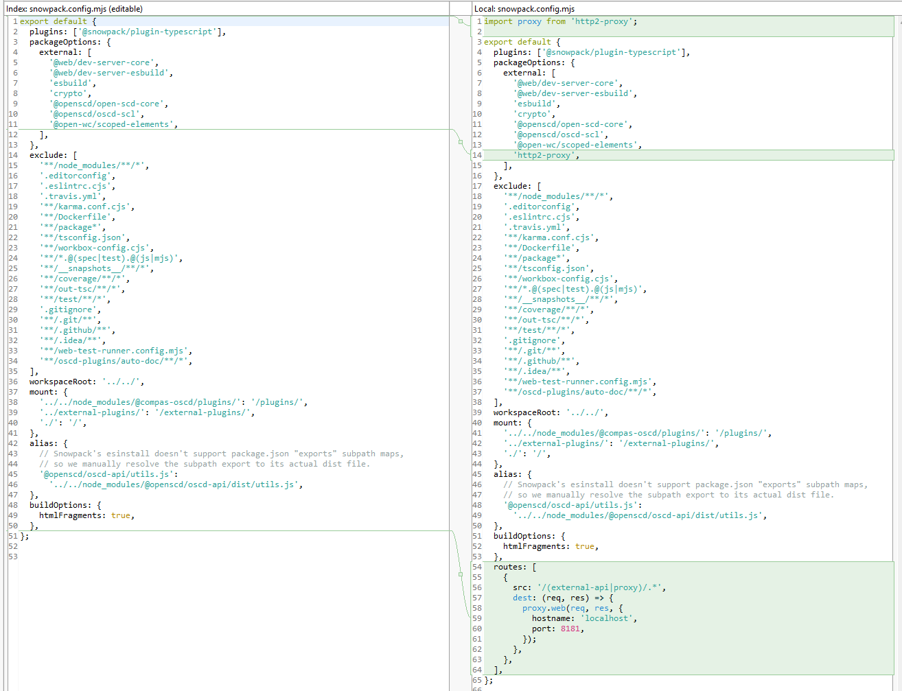
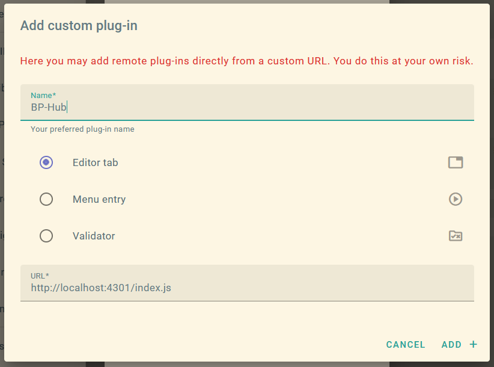

# Developer Guide

## Start Scripts

Three modes are available — all require WireMock running in parallel.

| Script | Hot Reload | Realism | Providers |
|--------|-----------|---------|-----------|
| `npm run run:plugins-hub` | Auto | Low | `providers.dev.json` |
| `npm run preview:plugins-hub` | Manual | Medium | `providers.dev.json` |
| `npm run preview:plugins-hub-prod` | Manual | High | `providers.json` (production) |

> **run** = fastest dev loop. **preview-prod** = closest to production behavior.

---

## Local Development (run)

```bash
npm run run:plugins-hub   # terminal 1 — dev server with HMR
npm run wiremock          # terminal 2 — mock API on port 8181 (required)
```

Open: http://localhost:4301

WireMock also serves host builtin catalogues for dual-provider testing:

| Path (proxied by Vite → 8181) | Provider |
|---|---|
| `/public/js/plugins.js` | CoMPAS Dummy (1 plugin) |
| `/openscd/src/plugins.js` | Open-SCD Dummy (1 plugin) |

Without WireMock, those paths fail and no builtin providers appear in standalone mode.

---

## Preview with full Compas stack

Needed for a realistic end-to-end test of the plugin inside Open-SCD.

**Terminal 1 — mocks:**
```bash
npm run wiremock
```

**Terminal 2 — preview server:**
```bash
npm run preview:plugins-hub          # dev providers
# OR
npm run preview:plugins-hub-prod     # production providers
```

**Terminal 3 — Compas Open-SCD (one-time setup):**
```bash
git clone https://github.com/com-pas/compas-open-scd
cd compas-open-scd
git submodule update --init --recursive
npm install
npm run build
cd packages/compas-open-scd
npm start
```

Open: http://localhost:8080

### Required patch in compas-open-scd

Edit [`packages/compas-open-scd/snowpack.config.mjs`](https://github.com/com-pas/compas-open-scd/blob/main/packages/compas-open-scd/snowpack.config.mjs) — add a proxy route so API calls reach WireMock:

```js
routes: [
  {
    src: '/(external-api|proxy)/.*',
    dest: (req, res) => {
      proxy.web(req, res, { hostname: 'localhost', port: 8181 });
    },
  },
],
```



### First-time plugin registration

After opening http://localhost:8080 for the first time, add the Plugin-Hub plugin manually:

- **Name:** `BP-Hub`
- **URL:** `http://localhost:4301/index.js`



