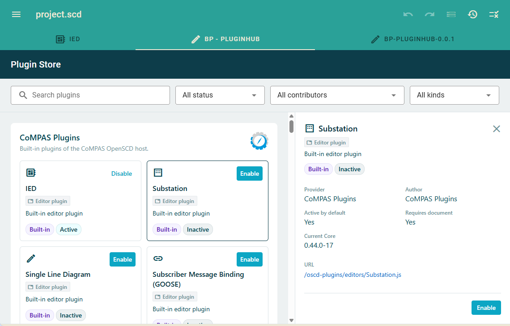
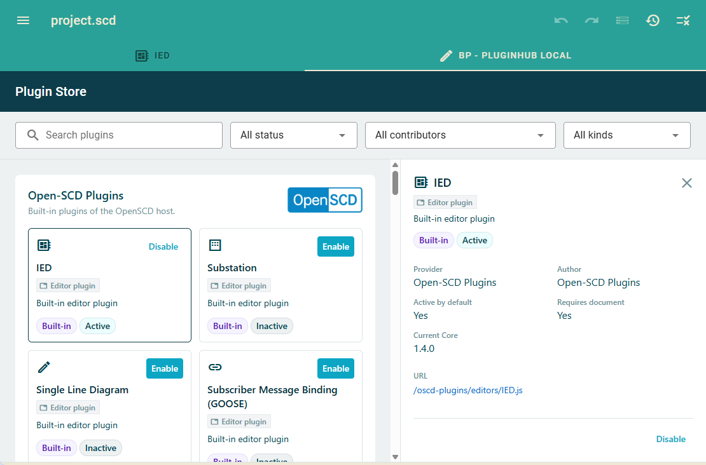
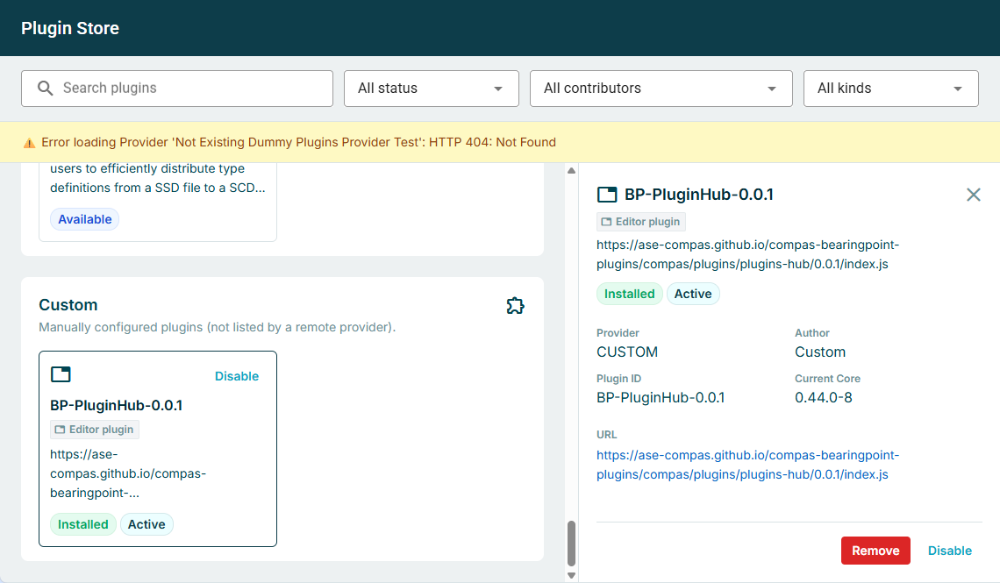
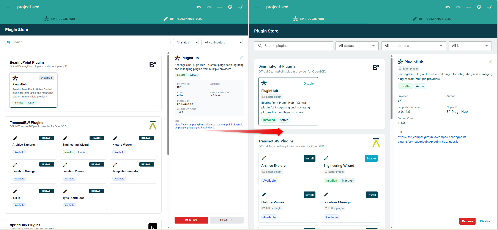

# Changelog

All notable changes to the **plugins-hub** application are documented in this file.

The format is based on [Keep a Changelog](https://keepachangelog.com/en/1.1.0/),
and this project adheres to [Semantic Versioning](https://semver.org/spec/v2.0.0.html).

## [Unreleased]

## [0.0.6]

### Fixed

- Implements [Issue #26](https://github.com/ase-compas/compas-bearingpoint-plugins/issues/26):
  Install / enable / disable no longer jump the provider list to the top.
  Host `plugins` updates re-merge install state without the loading
  placeholder; action buttons use `type="button"`.

### Changed

- Implements [Issue #25](https://github.com/ase-compas/compas-bearingpoint-plugins/issues/25):
  `oscd-configure-plugin` is dispatched from the Hub root (bubbles / composed)
  instead of `getLayout()`, so hosts without `<compas-layout>` / `<oscd-layout>`
  still receive install / enable / disable.
- Hub icons use `--oscd-icon-font` (default `'Material Symbols Outlined'`;
  old hosts without `--oscd-yellow` fall back to `'Material Icons Outlined'`).
  SMUI text-field icons need no `material-icons*` class; ligature spans use
  `.oscd-icons`.
- Installed plugins come from the host `plugins` property (same JSON shape as
  the former `localStorage['plugins']` key). The Hub no longer reads that
  storage key.
- Removes core-version handling: no `coreVersion` host property, no
  `supportedCoreVersion` on catalogue entries, no Incompatible badge or
  version-gated Install.
- Drops the localhost `proxyUrl()` rewrite. Catalogue `src` / `pluginsUrl` /
  icons are used as given (HTTPS from `http://localhost` is allowed).

## [0.0.5]

### Changed

- Implements [Issue #23](https://github.com/ase-compas/compas-bearingpoint-plugins/issues/23):
  Production bundle is a single `index.js`. Component/theme CSS is inlined at
  build time and injected as a `<style>` tag into the plugin Shadow DOM
  (no sibling `style.css` to host next to the script).
- Implements [Issue #18](https://github.com/ase-compas/compas-bearingpoint-plugins/issues/18):
  Plugin Hub no longer ships font files or loads Google Fonts. Icon classes
  (`.material-icons`, `.material-icons-outlined`, `.material-symbols-outlined`)
  live in `libs/global/oscd-typography.css` and use the host faces. Standalone
  dev registers the same OpenSCD fonts from `libs/global/dev/google/`.
  Text uses `var(--oscd-text-font)` (Roboto).
- Implements [Issue #12](https://github.com/ase-compas/compas-bearingpoint-plugins/issues/12):
  **Host theme inheritance:** Plugin Hub maps OpenSCD `--oscd-theme-*`
  (and older host tokens such as `--primary` / `--base*`) into internal
  `--oscd-*`, MDC/MD3, and existing `--bearingpoint-*` aliases, with Solarized
  fallbacks. It no longer forces a fixed BearingPoint palette or Material
  purple MDC reset, so the Hub matches branded OpenSCD / CoMPAS hosts.
- Badges and status colours derive from the theme palette (including dark mode).

### Added

- **Dev host theme playground** (standalone `run:plugins-hub` only): toggles
  brand + mode as separate CSS classes on `<html>` (e.g. `bearingpoint` +
  `light`); presets live in `libs/global/dev/`. Brands: `openscd` |
  `transnetbw` | `bearingpoint`, plus `-new` variants that set
  `color-scheme` so CSS `light-dark()` works. Floating toolbar and
  `?brand=&mode=` for light+dark without a full host.

## [0.0.4]

### Changed

- Implements [Issue #11](https://github.com/ase-compas/compas-bearingpoint-plugins/issues/11):
  Plugin Hub uses **registration `name` + `kind`** as the unique identifier
  instead of `src` (aligned with OpenSCD /
  [open-scd#157](https://github.com/com-pas/open-scd/issues/157)).
  - `src` remains the resource URL to load the plugin only.
  - Install, active/inactive state, and Custom catalogue membership follow
    name+kind, so version bumps, offline paths, or host rewrites no longer create
    duplicate hub entries for the same plugin.
  - Host localStorage duplicates for the same name+kind are collapsed when the
    hub reads them (last-wins fields, `active` OR-merged). Permanent host storage
    cleanup still depends on the host fix or reconfigure.
  - Provider (or custom) catalogue entries whose registration name+kind matches a
    host built-in are marked **Built-in** in that provider section
    (`shadowedByHostBuiltin`): Enable/Disable is disabled with a tooltip that a
    built-in of that name already exists; install/remove are blocked.
  - UI selection keys list entries by **provider + name + kind**, so a host
    built-in and a shadowed provider card can be selected independently.

## [0.0.3]

### Added

- Implements [Issue #9](https://github.com/ase-compas/compas-bearingpoint-plugins/issues/9): Show **built-in** host plugins and **custom** configured plugins in the Plugins Hub.

**Built-in providers (Open-SCD / CoMPAS)**

- Discover host `officialPlugins` at runtime.
- Show each reachable catalogue as its own provider; enable/disable only (no install/remove for build-in plugins).
- Provider logos shipped in the hub bundle (`compas.png` / `openscd.png`).

**Custom provider**

- List manually stored plugins whose `src` is not covered by any remote or built-in catalogue.
- Description is the plugin source URL; support enable, disable, and uninstall.

## [0.0.2]

### Added

- Implements [Issue #5](https://github.com/ase-compas/compas-bearingpoint-plugins/issues/5): Update Plugins Hub (apply mockup styling and related UX).

## [0.0.1]

### Added

- Implements [Issue #1](https://github.com/ase-compas/compas-bearingpoint-plugins/issues/1): Create Plugins Hub plugin.
