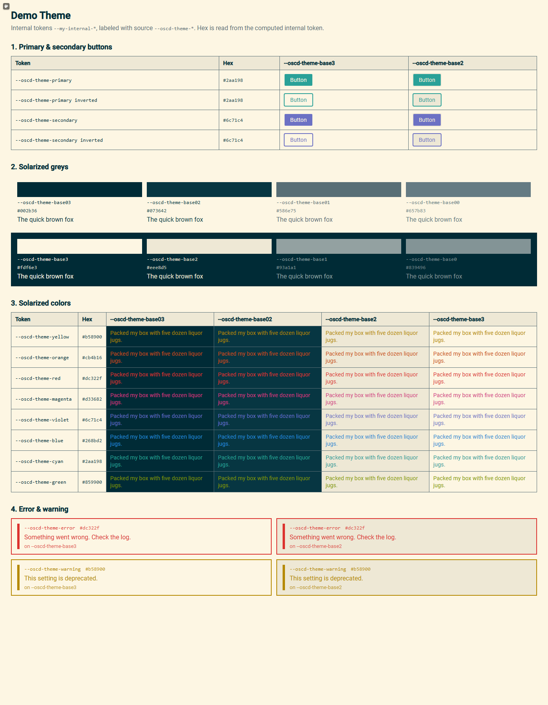
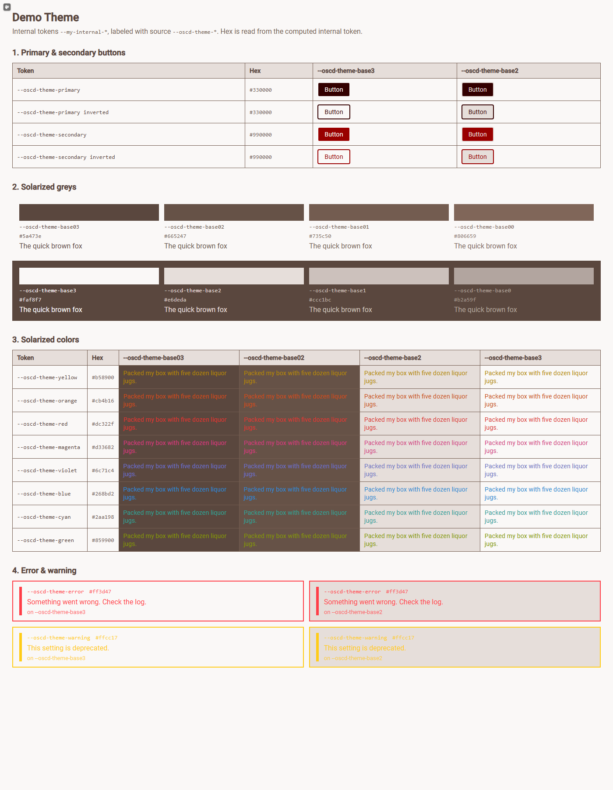
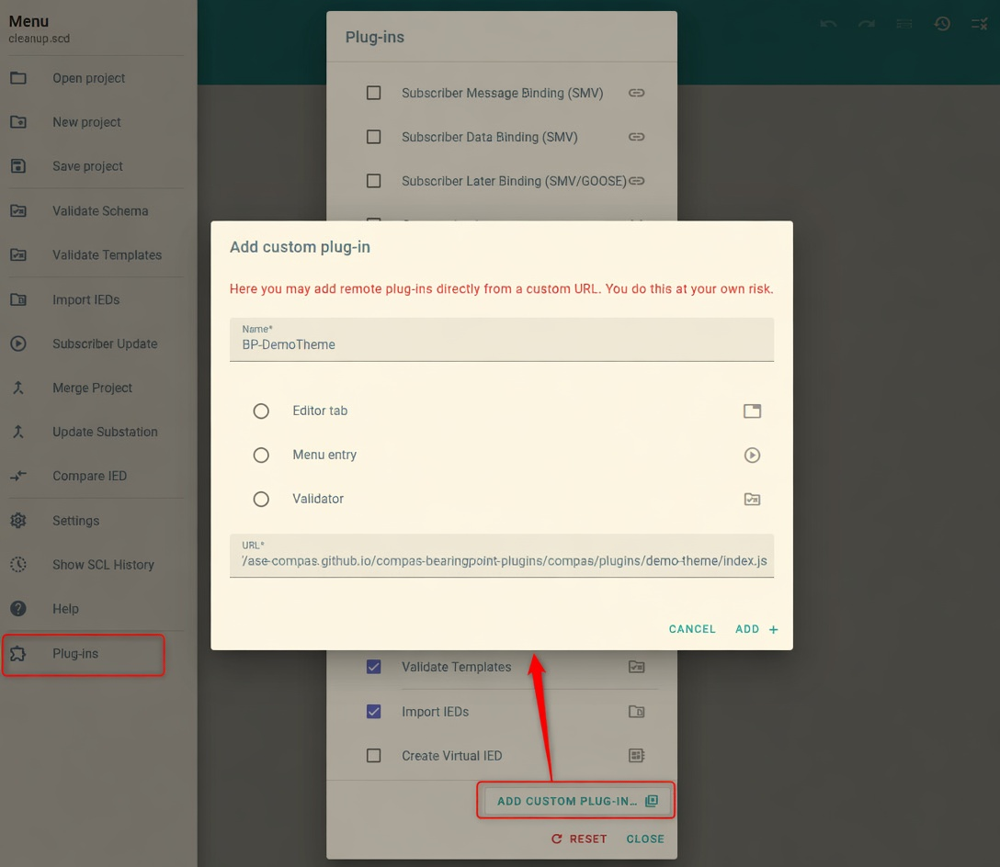

# Demo-Theme Plugin

When opening the plugin the plugin shows a live preview of the host OpenSCD/CoMPAS theme. It is a testing plugin for customer-specific branding and can also be used as an entry-point for plugin developers.

The preview is organised in four sections:

- Primary and secondary buttons
- Solarized greys (`base03` … `base3`)
- Solarized accent colours
- Error and warning

Each sample is labeled with the distro source token `--oscd-theme-*`. The shown hex value is read from the computed internal token, so you see the colour the plugin actually resolves.



The plugin does not ship a fixed brand look. A customer distro that sets `--oscd-theme-*` on the host is reflected immediately. The same plugin under a BearingPoint-branded palette:



This is the check used for customer-branded CoMPAS deployments described in [compas-open-scd#534](https://github.com/com-pas/compas-open-scd/issues/534).

## Theme tokens for plugin developers

Demo-Theme is a minimal plugin that shows the recommended theming pattern. Plugin developers can copy this as a starting point:

1. The distro defines `--oscd-theme-*` (official OpenSCD theme API).
2. The plugin maps those to **internal** tokens (`--my-internal-*`) with Solarized fallbacks.
3. Component CSS only uses the internal tokens.

The plugin **never** sets `--oscd-theme-*` itself and **never** hardcodes brand colours.

```
:root,
:host {
  --my-internal-primary: var(--oscd-theme-primary, #2aa198);
  --my-internal-secondary: var(--oscd-theme-secondary, #6c71c4);
  --my-internal-error: var(--oscd-theme-error, #dc322f);
  --my-internal-warning: var(--oscd-theme-warning, #b58900);

  --my-internal-base03: var(--oscd-theme-base03, light-dark(#002b36, #fdf6e3));
  --my-internal-base3: var(--oscd-theme-base3, light-dark(#fdf6e3, #002b36));
  /* … remaining Solarized bases and accents … */

  --my-internal-text-font: var(--oscd-theme-text-font, 'Roboto');
  --my-internal-icon-font: var(--oscd-theme-icon-font, 'Material Symbols Outlined');
}
```

Fallback chain (so older hosts without `--oscd-theme-*` still look correct):

1. `--oscd-theme-*` (official distro API)
2. Solarized defaults (readable unbranded OpenSCD look; the base scale uses `light-dark()`)

This follows the [OpenSCD theming docs](https://github.com/stee-re/oscd-api/blob/feat_add-theming-docs/docs/theming.md).

## Manual installation

BearingPoint Demo Theme – Testing-Plugin for Customer Themes

Drag this [BP-DemoTheme](javascript:%28function%28%29%7Btry%7Blet%20p%3DlocalStorage.getItem%28%22plugins%22%29%3Bif%28%21p%29%7Balert%28%27Kein%20%22plugins%22%20Eintrag%20im%20localStorage%20gefunden%27%29%3Breturn%7Dlet%20a%3DJSON.parse%28p%29%3Bif%28%21Array.isArray%28a%29%29%7Balert%28%27%22plugins%22%20ist%20kein%20Array%27%29%3Breturn%7Dconst%20n%3D%7Bname%3A%22BP%20-%20DemoTheme%22%2Cauthor%3A%22BearingPoint%20Plugins%22%2Csrc%3A%22https%3A%2F%2Fase-compas.github.io%2Fcompas-bearingpoint-plugins%2Fcompas%2Fplugins%2Fdemo-theme%2Findex.js%22%2Cicon%3A%22hub%22%2Ckind%3A%22editor%22%2Cdescription%3A%22BearingPoint%20Demo%20Theme%20%E2%80%93%20Testing-Plugin%20for%20Customer%20Themes.%20See%20https%3A%2F%2Fgithub.com%2Fcom-pas%2Fcompas-open-scd%2Fissues%2F534%22%2CrequireDoc%3Atrue%2Cactive%3Atrue%2Cinstalled%3Atrue%7D%3Bif%28a.some%28x%3D%3Ex%3F.name%3D%3D%3Dn.name%29%29%7Balert%28%27Plugin%20%22%27%2Bn.name%2B%27%22%20ist%20bereits%20vorhanden%27%29%3Breturn%7Da.push%28n%29%3BlocalStorage.setItem%28%22plugins%22%2CJSON.stringify%28a%29%29%3Balert%28%22Plugin%20erfolgreich%20hinzugef%C3%BCgt%21%22%29%7Dcatch%28e%29%7Balert%28%22Fehler%3A%20%22%2Be.message%29%7D%7D%29%28%29%3B) to your bookmarks bar, then open an OpenSCD/CoMPAS instance and click the bookmark. Or install manually:

GOTO: [demo.compas.energy](https://demo.compas.energy/) or any other OpenSCD or Compas Instance and add the Plugin:

* **Name:** BP-DemoTheme
* **URL:** https://ase-compas.github.io/compas-bearingpoint-plugins/compas/plugins/demo-theme/index.js


