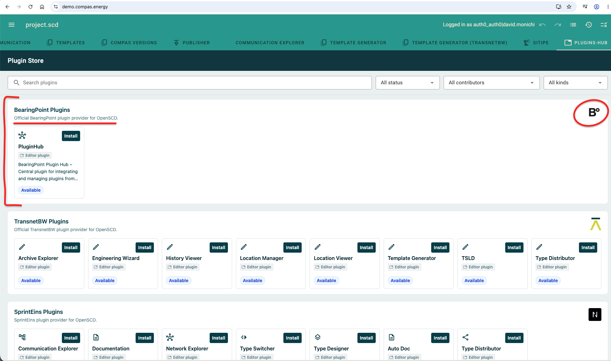
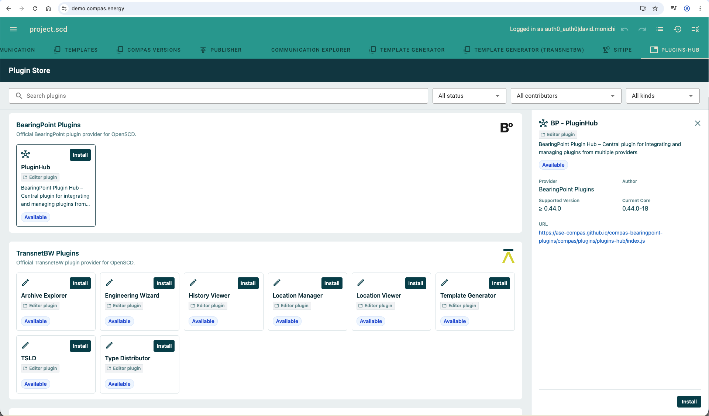
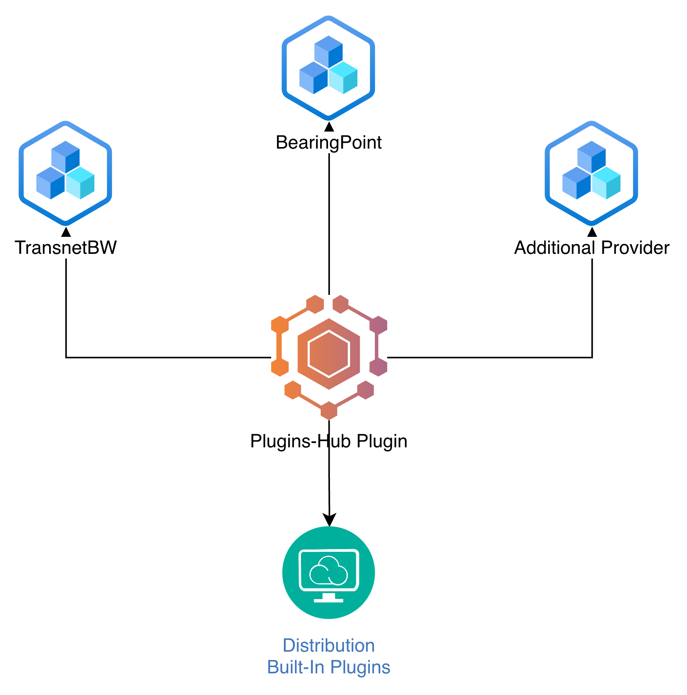
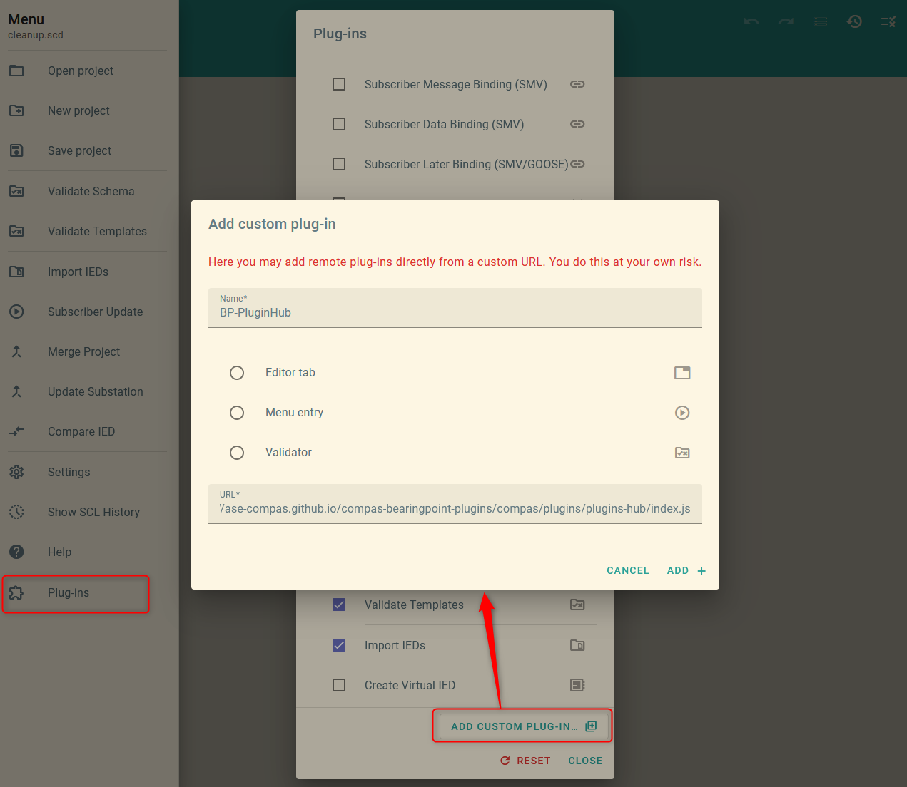

# Plugins-Hub Plugin

When opening the plugin the plugin shows a list of official plugins provider which support OpenSCD/CoMPAS. For each provider following information can be set:

- Provider name
- Logo
- List of provided plugins



Each plugin can be managed within this overview, which means a plugin can be installed, enabled and disabled if needed. Further each plugin provides informations about the minimal required OpenSCD/CoMPAS core version to provide you to install incompatible plugins.

Further each plugin should provide a short documentation which will be shown inline in Plugins-Hub plugin. Additional to that a link can be provided so that additional plugin documentation can be provided.



## Distributed plugins maintenance

The Plugin is organised as following:



The plugin loads plugins from a JSON file (for example, plugins.json) provided by one or more plugin providers. The distributor can centrally define the list of supported plugin providers for their distribution, allowing the plugin to discover and load all plugins they publish.

The json file structure a provider needs to provide looks as following:
```
    {
        "plugins": [
            {
                "name": "PluginHub",
                "kind": "editor",
                "description": "BearingPoint Plugin Hub – Central plugin for integrating and managing plugins from multiple providers",
                "src": "https://ase-compas.github.io/compas-bearingpoint-plugins/compas/plugins/plugins-hub/index.js",
                "documentationUrl": "https://ase-compas.github.io/compas-bearingpoint-plugins/plugins/plugins-hub",
                "icon": "hub"
            }
        ]
    }
```

Except the `documentationUrl` all fields are required, if the Plugins-Hub has parsing error, the full file will be skipped.

If a plugins provider wants to be added to the trusted plugins provider list of an distributor each distributor might have different processes on how to be added.

## Manual installation

BearingPoint Plugin Hub – Central plugin for integrating and managing plugins from multiple providers

Drag this [BP-PluginHub](javascript:%28function%28%29%7Btry%7Blet%20p%3DlocalStorage.getItem%28%22plugins%22%29%3Bif%28%21p%29%7Balert%28%27Kein%20%22plugins%22%20Eintrag%20im%20localStorage%20gefunden%27%29%3Breturn%7Dlet%20a%3DJSON.parse%28p%29%3Bif%28%21Array.isArray%28a%29%29%7Balert%28%27%22plugins%22%20ist%20kein%20Array%27%29%3Breturn%7Dconst%20n%3D%7Bname%3A%22BP%20-%20PluginHub%22%2Cauthor%3A%22BearingPoint%20Plugins%22%2Csrc%3A%22https%3A%2F%2Fase-compas.github.io%2Fcompas-bearingpoint-plugins%2Fcompas%2Fplugins%2Fplugins-hub%2Findex.js%22%2Cicon%3A%22hub%22%2Ckind%3A%22editor%22%2Cdescription%3A%22BearingPoint%20Plugin%20Hub%20%E2%80%93%20Central%20plugin%20for%20integrating%20and%20managing%20plugins%20from%20multiple%20providers%22%2CrequireDoc%3Atrue%2Cactive%3Atrue%2Cinstalled%3Atrue%7D%3Bif%28a.some%28x%3D%3Ex%3F.name%3D%3D%3Dn.name%29%29%7Balert%28%27Plugin%20%22%27%2Bn.name%2B%27%22%20ist%20bereits%20vorhanden%27%29%3Breturn%7Da.push%28n%29%3BlocalStorage.setItem%28%22plugins%22%2CJSON.stringify%28a%29%29%3Balert%28%22Plugin%20erfolgreich%20hinzugef%C3%BCgt%21%22%29%7Dcatch%28e%29%7Balert%28%22Fehler%3A%20%22%2Be.message%29%7D%7D%29%28%29%3B) to your bookmarks bar, then open an OpenSCD/CoMPAS instance and click the bookmark. Or install manually:

GOTO: [demo.compas.energy](https://demo.compas.energy/) or any other OpenSCD or Compas Instance and add the Plugin:

* **Name:** BP-PluginHub
* **URL:** https://ase-compas.github.io/compas-bearingpoint-plugins/compas/plugins/plugins-hub/index.js


